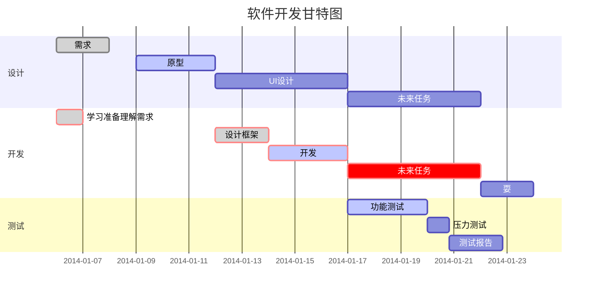

## 时钟计划


```## 该计划旨在利用下述几种硬件制作一款多功能点阵时钟，具体硬件可能会临时调整升级```

```## 所有控制代码从底层实现，不使用任何arduino平台的库```

```## 尽量不实用C语言库 ```


+   ### 计划使用硬件

>   +   ESP8266   
>
>   +   DS1302   
>   +   MAX7219   
>   +   1288AW8*8共阴极白光点阵   
>   +   DHT11   

+   ### 预期软件功能

>   +   无网自动走时
>   +   有网自动对时
>   +   拨码开关手动对时
>   +   日期、温湿度轮播


+   ### 进度栏

    1.  RTC模块DS1302已完成驱动
    2.  显示模块max7219已完成驱动（翻页功能稍候）
    3.  COLOCK文件夹为已完成功能的完全整合
    4.  max7219_proteus文件夹仿真工程文件夹




